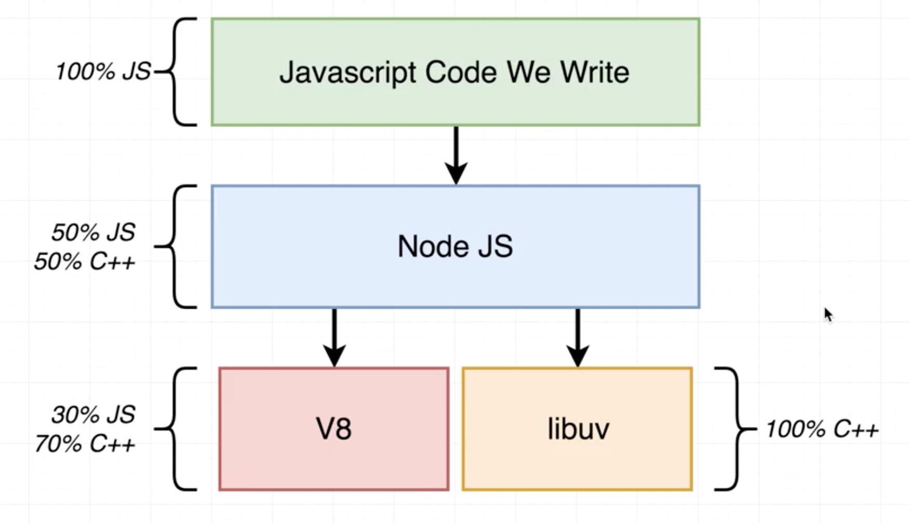

# Node JS: Advanced Concepts

* Nodejs is separated in two dependencies

  * v8: An open source JS engine created by google. Its main purpose is to execute JS code outside of the browser

    * V8 compiles JavaScript directly to native machine code before executing it, instead of more traditional techniques such as interpreting bytecode or compiling the whole program to machine code and executing it from a filesystem. The compiled code is additionally optimized (and re-optimized) dynamically at runtime, based on heuristics of the code's execution profile. Optimization techniques used include inlining, elision of expensive runtime properties, and inline caching. The garbage collector is a generational incremental collector.

  * libuv: A c++ open source project that gives node access to the operating system underline file system, networking and some aspects of concurrency.
  



* Nodejs gives us a nice interface to use to related the JS side of our application to the C++ side of things. Node also provides a series of wrappers (fs, crypto, etc..)


* Inside the Node repo we can find two main folders (https://github.com/nodejs/node)
  * ```lib```: is where all the JS code is located
    * Example: https://github.com/nodejs/node/tree/master/lib/internal/crypto/pbkdf2.js
    * This file is mostly validating inputs and forwarding this to the C++ function
    * ```javascript
    const {
      PBKDF2
    } = process.binding('crypto');
    const ret = PBKDF2(password, salt, iterations, keylen, digest);
    ```
    * ```process.binding```: It's a feature that essentially goes out and grab the C++ feature and make it available inside the javascript

  * ```src```: is where all the C++ is located, and where node pulls ```libuv``` and ```v8```

    * ```PBKDF2``` is located inside  https://github.com/nodejs/node/blob/master/src/node_crypto.cc
    * ```cpp
    env->SetMethod(target, "PBKDF2", PBKDF2);

    void PBKDF2(const FunctionCallbackInfo<Value>& args) {
    Environment* env = Environment::GetCurrent(args);

    const EVP_MD* digest = nullptr;
    int keylen = -1;
    ```

  
